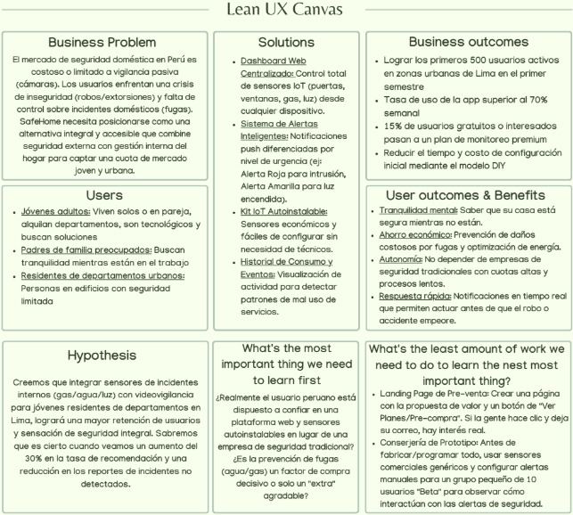

### Universidad Peruana de Ciencias Aplicadas  
### Ingeniería de Software  
### 2026-1  

### NRC: 11834  
### Docente: Ivan Robles Fernandez
### Informe de Trabajo Final  

### SoftTech  
### SafeHome  

| **Código** | **Integrante** |
|------------|----------------|
| U20241D932 | Briguite Eryka Carhuaz Centeno |
| U202319329 | Gonzalo Alexander Jaime Forcelledo |
| U201911393 | Mauricio Jared Padilla Merino |
| U202115654 | Luis Ángel Pililaca Vidal |
| U202411373 | Valeria Alexandra Rojas Gómez |

### Abril 2026

---

# Registro de Versiones del Informe

| Versión | Fecha | Autor | Descripción de modificación |
|---------|-------|-------|-----------------------------|
| 1.0 | 08/04/2026 | Grupo SoftTech | Se avanzaron los capítulos correspondientes al AV1 del proyecto SafeHome. |

---

# Project Report Collaboration Insights

**URL del Repositorio:** [SafeHome Project Report](https://github.com/upc-pre-2610-1ASI0729-11834-SoftTech/SafeHome-report)

El informe del proyecto SafeHome fue desarrollado de manera colaborativa por el equipo SoftTech mediante GitHub. Para organizar el trabajo, se utilizó una rama principal `main`, una rama de integración `develop` y ramas `feature/chapter-*` para distribuir el desarrollo del reporte por capítulos.

Cada integrante trabajó en la rama correspondiente a su capítulo o sección asignada, realizando commits con mensajes descriptivos bajo la convención de Conventional Commits. Esta organización permitió mantener la trazabilidad de los cambios, evidenciar la participación del equipo y facilitar la integración progresiva del informe.

---

# Student Outcome ABET 3

**Capacidad de comunicarse efectivamente con un rango de audiencias.**

| Criterio específico | Descripción | Acciones realizadas | Conclusiones |
|--------------------|-------------|---------------------|--------------|
| 3.c1. Comunica oralmente con efectividad a diferentes rangos de audiencia | El estudiante comunica resultados y proceso de ingeniería aplicado para el ciclo de desarrollo y despliegue de una solución web distribuida bajo una arquitectura orientada a servicios, con enfoque innovador e inclusivo. | AV1: El equipo explicó los avances del proyecto SafeHome, incluyendo la problemática, análisis de usuarios, diseño UX/UI, propuesta técnica e implementación inicial. | El equipo logró comunicar oralmente los principales resultados del avance, sustentando las decisiones tomadas en el diseño y desarrollo de la solución. |
| 3.c2. Comunica por escrito con efectividad a diferentes rangos de audiencia | El estudiante comunica por escrito los resultados y el proceso de ingeniería aplicado en el desarrollo de una solución web distribuida. | AV1: El equipo documentó el informe en formato Markdown, registrando evidencias, decisiones de diseño, requisitos, diagramas, arquitectura y avances de implementación. | La documentación permitió comunicar de manera ordenada el proceso de desarrollo del proyecto SafeHome. |

---

# Contenido

- [Registro de Versiones del Informe](#registro-de-versiones-del-informe)
- [Project Report Collaboration Insights](#project-report-collaboration-insights)
- [Student Outcome ABET 3](#student-outcome-abet-3)

- [Capítulo I: Introducción](#capítulo-i-introducción)
  - [1.1. Startup Profile](#11-startup-profile)
    - [1.1.1. Descripción de la Startup](#111-descripción-de-la-startup)
    - [1.1.2. Perfiles de integrantes del equipo](#112-perfiles-de-integrantes-del-equipo)
  - [1.2. Solution Profile](#12-solution-profile)
    - [1.2.1. Antecedentes y problemática](#121-antecedentes-y-problemática)
    - [1.2.2. Lean UX Process](#122-lean-ux-process)
      - [1.2.2.1. Lean UX Problem Statements](#1221-lean-ux-problem-statements)
      - [1.2.2.2. Lean UX Assumptions](#1222-lean-ux-assumptions)
      - [1.2.2.3. Lean UX Hypothesis Statements](#1223-lean-ux-hypothesis-statements)
      - [1.2.2.4. Lean UX Canvas](#1224-lean-ux-canvas)
  - [1.3. Segmentos objetivo](#13-segmentos-objetivo)

- [Capítulo II: Requirements Elicitation & Analysis](#capítulo-ii-requirements-elicitation--analysis)
  - [2.1. Competidores](#21-competidores)
    - [2.1.1. Análisis competitivo](#211-análisis-competitivo)
    - [2.1.2. Estrategias y tácticas frente a competidores](#212-estrategias-y-tácticas-frente-a-competidores)
  - [2.2. Entrevistas](#22-entrevistas)
    - [2.2.1. Diseño de entrevistas](#221-diseño-de-entrevistas)
    - [2.2.2. Registro de entrevistas](#222-registro-de-entrevistas)
    - [2.2.3. Análisis de entrevistas](#223-análisis-de-entrevistas)
  - [2.3. Needfinding](#23-needfinding)
    - [2.3.1. User Personas](#231-user-personas)
    - [2.3.2. User Task Matrix](#232-user-task-matrix)
    - [2.3.3. User Journey Mapping](#233-user-journey-mapping)
    - [2.3.4. Empathy Mapping](#234-empathy-mapping)
  - [2.4. Big Picture Event Storming](#24-big-picture-event-storming)
  - [2.5. Ubiquitous Language](#25-ubiquitous-language)

- [Capítulo III: Requirements Specification](#capítulo-iii-requirements-specification)
  - [3.1. User Stories](#31-user-stories)
  - [3.2. Impact Mapping](#32-impact-mapping)
  - [3.3. Product Backlog](#33-product-backlog)

- [Capítulo IV: Product Design](#capítulo-iv-product-design)
  - [4.1. Style Guidelines](#41-style-guidelines)
    - [4.1.1. General Style Guidelines](#411-general-style-guidelines)
    - [4.1.2. Web Style Guidelines](#412-web-style-guidelines)
  - [4.2. Information Architecture](#42-information-architecture)
    - [4.2.1. Organization Systems](#421-organization-systems)
    - [4.2.2. Labeling Systems](#422-labeling-systems)
    - [4.2.3. SEO Tags and Meta Tags](#423-seo-tags-and-meta-tags)
    - [4.2.4. Searching Systems](#424-searching-systems)
    - [4.2.5. Navigation Systems](#425-navigation-systems)
  - [4.3. Landing Page UI Design](#43-landing-page-ui-design)
    - [4.3.1. Landing Page Wireframe](#431-landing-page-wireframe)
    - [4.3.2. Landing Page Mock-up](#432-landing-page-mock-up)
  - [4.4. Web Applications UX/UI Design](#44-web-applications-uxui-design)
    - [4.4.1. Web Applications Wireframes](#441-web-applications-wireframes)
    - [4.4.2. Web Applications Wireflow Diagrams](#442-web-applications-wireflow-diagrams)
    - [4.4.3. Web Applications Mock-ups](#443-web-applications-mock-ups)
    - [4.4.4. Web Applications User Flow Diagrams](#444-web-applications-user-flow-diagrams)
  - [4.5. Web Applications Prototyping](#45-web-applications-prototyping)
  - [4.6. Domain-Driven Software Architecture](#46-domain-driven-software-architecture)
    - [4.6.1. Design-Level Event Storming](#461-design-level-event-storming)
    - [4.6.2. Software Architecture Context Diagram](#462-software-architecture-context-diagram)
    - [4.6.3. Software Architecture Container Diagrams](#463-software-architecture-container-diagrams)
    - [4.6.4. Software Architecture Components Diagrams](#464-software-architecture-components-diagrams)
  - [4.7. Software Object-Oriented Design](#47-software-object-oriented-design)
    - [4.7.1. Class Diagrams](#471-class-diagrams)
  - [4.8. Database Design](#48-database-design)
    - [4.8.1. Database Diagrams](#481-database-diagrams)

- [Capítulo V: Product Implementation, Validation & Deployment](#capítulo-v-product-implementation-validation--deployment)
  - [5.1. Software Configuration Management](#51-software-configuration-management)
    - [5.1.1. Software Development Environment Configuration](#511-software-development-environment-configuration)
    - [5.1.2. Source Code Management](#512-source-code-management)
    - [5.1.3. Source Code Style Guide & Conventions](#513-source-code-style-guide--conventions)
    - [5.1.4. Software Deployment Configuration](#514-software-deployment-configuration)
  - [5.2. Landing Page, Services & Applications Implementation](#52-landing-page-services--applications-implementation)
    - [5.2.1. Sprint 1](#521-sprint-1)
      - [5.2.1.1. Sprint Planning 1](#5211-sprint-planning-1)
      - [5.2.1.2. Aspect Leaders and Collaborators](#5212-aspect-leaders-and-collaborators)
      - [5.2.1.3. Sprint Backlog 1](#5213-sprint-backlog-1)
      - [5.2.1.4. Development Evidence for Sprint Review](#5214-development-evidence-for-sprint-review)
      - [5.2.1.5. Execution Evidence for Sprint Review](#5215-execution-evidence-for-sprint-review)
      - [5.2.1.6. Services Documentation Evidence for Sprint Review](#5216-services-documentation-evidence-for-sprint-review)
      - [5.2.1.7. Software Deployment Evidence for Sprint Review](#5217-software-deployment-evidence-for-sprint-review)
      - [5.2.1.8. Team Collaboration Insights during Sprint](#5218-team-collaboration-insights-during-sprint)

- [Conclusiones](#conclusiones)
- [Bibliografía](#bibliografía)
- [Anexos](#anexos)

---

# SafeHome Smart Security System

## Capítulo I: Introducción

## 1.1. Startup Profile

Últimamente en el Perú se está viviendo una crisis de inseguridad ciudadana alarmante. Algunos ejemplos de esta problemática son las extorsiones, el sicariato, el aumento de violencia en las calles, el robo de celulares y el robo dentro de viviendas o intentos de robo en hogares. Este último problema es el que la aplicación **SafeHome** busca reducir significativamente.

SafeHome ofrece no solo seguridad o videovigilancia externa del hogar, sino también monitoreo en el interior de las viviendas para evitar fugas o el mal uso de servicios como luz, agua o gas. Para ello, la solución integra tecnología IoT mediante sensores especializados capaces de detectar anomalías en tiempo real y alertar oportunamente a los usuarios a través de una plataforma digital. De esta manera, se brinda una solución innovadora frente a una problemática que afecta a un gran sector de la población.

---

## 1.1.1. Descripción de la Startup

**SafeHome** es una startup tecnológica enfocada en el desarrollo de soluciones inteligentes para la seguridad doméstica. Nuestro objetivo es reducir la vulnerabilidad de los hogares frente a robos e incidentes internos a través de un sistema integral de monitoreo en tiempo real que combina sensores inteligentes y automatización, accesible mediante una plataforma web desde cualquier dispositivo.

SafeHome está dirigida principalmente a jóvenes adultos, familias y residentes de departamentos urbanos que requieren alternativas de seguridad accesibles, modernas y fáciles de implementar. La propuesta de valor de la startup se basa en ofrecer una solución escalable, económica y adaptable que no solo supervise el acceso al hogar, sino que también detecte situaciones anómalas dentro de la vivienda, contribuyendo a mejorar la seguridad, tranquilidad y calidad de vida de los habitantes.

---

## 1.1.2. Perfiles de integrantes del equipo

| Integrante | Perfil |
|---|---|
|  | **Briguite Eryka Carhuaz Centeno**   **Código:** U20241D932    Soy estudiante de Ingeniería de Software con capacidad para desempeñarme tanto en Frontend como en Backend. Cuento con un sólido dominio de lenguajes como Java y C++, además de experiencia en el diseño de prototipos con Figma. Durante el ciclo pasado, desarrollé proyectos basados en IoT, lo que me ha permitido fortalecer mi lógica de programación y visión técnica. Me caracterizo por ser una persona receptiva a las opiniones de los demás y siempre estoy dispuesta a apoyar a mis compañeros para asegurar que el proyecto avance con éxito. |
|  | **Jaime Forcelledo, Gonzalo Alexander**   **Código:** U202319329    Actualmente estoy estudiando Ingeniería de Software en la UPC. Me considero una persona curiosa y apasionada por el aprendizaje continuo. La música me encanta, descubrir nuevos géneros y artistas para enriquecer mis experiencias auditivas. |
|  | **Mauricio Jared Padilla Merino**   **Código:** U201911393   **Carrera:** Ingeniería de Software    Me encuentro cursando el quinto ciclo de mi carrera. Me considero una persona con buena capacidad de planeación y estructuración de proyectos de esta escala, siempre manteniendo una buena comunicación con mis compañeros para escuchar críticas o feedback constructivo sobre el proyecto. De esta manera, me aseguro de que todos podamos contribuir con nuestro fuerte y dar el mejor esfuerzo para el proyecto. |
|  | **Valeria Alexandra Rojas Gómez**   **Código:** U202411373   **Carrera:** Ingeniería de Software    Me considero una persona respetuosa y motivada, capaz de trabajar en equipo y cumplir con los plazos establecidos de las entregas. Me apasiona la gastronomía, el turismo, la naturaleza y los videojuegos. |
|  | **Pillaca Vidal Luis Angel**   **Código:** U202315654   **Carrera:** Ingeniería de Software    Me considero una persona disciplinada y orientada a objetivos, con capacidad para trabajar en equipo y cumplir con los plazos establecidos. Tengo interés en el desarrollo tecnológico, especialmente en la creación de aplicaciones web y el uso de bases de datos como MongoDB y SQL. Me apasiona construir soluciones funcionales y bien diseñadas, y actualmente estoy enfocado en proyectos como el desarrollo de interfaces modernas y plataformas digitales orientadas a la seguridad y monitoreo. |

---

## 1.2. Solution Profile

### Nombre del producto

**SafeHome Smart Security System** es una solución tecnológica integral basada en Internet de las Cosas (IoT) que permite monitorear y proteger el hogar en tiempo real. El sistema combina sensores inteligentes, videovigilancia y una plataforma web accesible desde cualquier dispositivo, con el fin de detectar intrusiones, fugas de gas, consumo inusual de agua o energía, y otras anomalías dentro y fuera del hogar.

### Propuesta de valor

Brindar seguridad doméstica inteligente, accesible y en tiempo real, integrando monitoreo externo e interno del hogar en una sola plataforma fácil de usar.

### Misión

Brindar soluciones inteligentes de seguridad doméstica mediante tecnología IoT, que permitan a las personas proteger sus hogares de manera eficiente, accesible y en tiempo real, mejorando su tranquilidad y calidad de vida.

### Visión

Ser la startup líder en seguridad inteligente para el hogar en el Perú y Latinoamérica, reconocida por innovar en tecnología, prevenir riesgos y transformar la forma en que las personas protegen sus viviendas.

### Valores

- Innovación
- Compromiso
- Seguridad
- Accesibilidad
- Responsabilidad
- Confianza

---

## 1.2.1. Antecedentes y problemática

En los últimos años, la inseguridad ciudadana se ha convertido en una de las principales preocupaciones sociales en el Perú, especialmente en zonas urbanas como Lima Metropolitana. El incremento sostenido de delitos contra el patrimonio, incluyendo robos domiciliarios, ha generado una creciente sensación de vulnerabilidad en los hogares.

Según el Instituto Nacional de Estadística e Informática (INEI), una proporción significativa de la población urbana percibe que la delincuencia ha aumentado, afectando directamente la calidad de vida y la tranquilidad de las familias. Paralelamente, el crecimiento de viviendas verticales y departamentos ha planteado nuevos desafíos en materia de seguridad, ya que muchos sistemas tradicionales se enfocan únicamente en el control de accesos externos, dejando sin monitoreo adecuado los espacios internos del hogar (INEI, 2024).

Adicionalmente, el avance de tecnologías basadas en Internet de las Cosas (IoT) ha permitido el desarrollo de soluciones inteligentes capaces de integrar sensores, monitoreo remoto y análisis en tiempo real para la prevención de incidentes domésticos y situaciones de riesgo. Sin embargo, muchas de estas soluciones continúan siendo costosas o poco accesibles para un amplio sector de la población, limitando su adopción en hogares de ingresos medios y jóvenes independientes.

Investigaciones recientes destacan que la implementación de sistemas inteligentes de seguridad doméstica puede reducir riesgos asociados tanto a intrusiones como a fallas en servicios básicos como gas, agua o electricidad, evidenciando la necesidad de desarrollar plataformas tecnológicas accesibles, integradas y orientadas al usuario final (Almeida, Rodrigues & Silva, 2022). En este contexto, surge la oportunidad de diseñar una solución que combine monitoreo interno inteligente, accesibilidad económica y facilidad de uso para mejorar la seguridad integral del hogar.

---

## 1.2.2. Lean UX Process

El proceso Lean UX aplicado al desarrollo de **SafeHome Smart Security System** se basa en un enfoque iterativo centrado en el usuario, que busca validar ideas rápidamente mediante la experimentación y el aprendizaje continuo.

En primer lugar, se define el problema identificando las principales preocupaciones de los usuarios relacionadas con la inseguridad en el hogar y la falta de soluciones accesibles. A partir de ello, se plantean suposiciones e hipótesis sobre el comportamiento de los usuarios y el valor que podría ofrecer la solución.

Luego, se procede a la fase de diseño, donde se crean prototipos simples de la plataforma, como wireframes o mockups, que permiten visualizar cómo funcionará el sistema. Estos prototipos no son definitivos, sino que sirven para recoger opiniones tempranas de los usuarios.

Posteriormente, se realiza la validación mediante pruebas con usuarios reales, quienes interactúan con los prototipos y brindan retroalimentación sobre la usabilidad, funcionalidad y utilidad del sistema. Esta información es clave para identificar mejoras.

Finalmente, se entra en un ciclo continuo de aprendizaje, donde, en base a los resultados obtenidos, se ajusta la solución, se mejoran las funcionalidades y se vuelve a probar. Este proceso iterativo permite desarrollar un producto más alineado con las necesidades reales del usuario, reduciendo riesgos y optimizando recursos.

---

## 1.2.2.1. Lean UX Problem Statements

Actualmente, muchas viviendas en Lima enfrentan un aumento en la inseguridad, especialmente por robos dentro del hogar. Sin embargo, los sistemas de seguridad tradicionales se enfocan solo en puertas y ventanas, dejando de lado lo que ocurre dentro de la vivienda. Por otro lado, no existen muchas soluciones accesibles que integren sensores internos inteligentes para detectar movimientos o situaciones sospechosas en tiempo real, lo que genera una sensación de vulnerabilidad en los usuarios.

Cabe resaltar que la inseguridad ha ido en aumento en los últimos años. En Lima Metropolitana, los delitos denunciados crecieron en un 39.8%, siendo el 78.8% relacionados con delitos contra el patrimonio (Davila, 2025). Asimismo, las viviendas verticales crecieron en un 116.6%, lo que plantea nuevos retos en seguridad (Calderon et al., 2021). Sin embargo, el 10.67% de viviendas urbanas han sido víctimas de robo o intento de robo, evidenciando una clara brecha en la protección del hogar (Calderon et al., 2021).

Adicionalmente, mejorar la seguridad dentro del hogar es fundamental, ya que estos problemas afectan tanto económica como emocionalmente. Asimismo, los sistemas actuales no cubren completamente las necesidades del usuario moderno, especialmente en interiores. En este contexto, el proyecto se enfoca en la seguridad tecnológica del hogar, dirigido a personas en departamentos, familias y jóvenes independientes que enfrentan falta de monitoreo interno, altos costos y poca integración.

Sin embargo, existe una oportunidad de desarrollar una solución accesible que combine sensores internos y monitoreo en tiempo real. En primer lugar, la visión es crear un sistema integral que proteja tanto el exterior como el interior del hogar, mediante una plataforma web o app escalable. El segmento inicial estará enfocado en jóvenes adultos que viven en departamentos en Lima.

En conclusión, se plantea la siguiente pregunta:

> ¿Cómo mejorar la seguridad dentro del hogar con sensores inteligentes accesibles?

Como respuesta, el objetivo es desarrollar un sistema con monitoreo en tiempo real, que permita analizar limitaciones actuales, implementar sensores adecuados, diseñar una plataforma funcional y evaluar su desempeño mediante indicadores como tiempo de respuesta y satisfacción del usuario.

---

## 1.2.2.2. Lean UX Assumptions

Para el desarrollo de **SafeHome Smart Security System**, partimos de algunas suposiciones clave basadas en el enfoque Lean UX, las cuales nos ayudarán a validar si nuestra solución realmente responde a las necesidades de los usuarios.

En primer lugar, creemos que nuestros usuarios serán principalmente jóvenes adultos y familias que viven en zonas urbanas y que están preocupados por la seguridad de sus hogares. Además, asumimos que buscan soluciones accesibles, fáciles de usar y que puedan controlar desde su celular o computadora sin complicaciones.

También consideramos que actualmente existe un problema real con la inseguridad, especialmente en robos a viviendas, y que muchas soluciones disponibles son costosas o difíciles de implementar. A esto se suma que dentro del hogar también hay riesgos como fugas de gas o fallas eléctricas que normalmente no se monitorean.

Finalmente, asumimos que un sistema basado en sensores IoT será efectivo para detectar estas situaciones y que, si ofrecemos una plataforma simple y útil, los usuarios podrán sentirse más seguros y tranquilos en su día a día.

---

## 1.2.2.3. Lean UX Hypothesis Statements

### 1.2.2.3.1. Hipótesis de negocio

#### Hipótesis de negocio 1

Creemos que ofrecer una aplicación de seguridad del hogar para personas que desean tener un control y monitoreo de su vivienda logrará adquirir usuarios rápidamente si incluimos que la aplicación sea gratuita.

Sabremos que es exitoso cuando alcancemos por lo menos **500 descargas durante el primer mes**.

#### Hipótesis de negocio 2

Creemos que implementar y ofrecer suscripciones premium con monitoreo y detección de fugas de gas para propietarios que buscan reducir riesgos y optimizar costos permitirá generar ingresos sostenibles si implementamos funciones avanzadas como alertas en tiempo real y asistencia técnica especializada.

Sabremos que habrá tenido éxito cuando un porcentaje significativo, alrededor del **10%**, adquiera esta suscripción premium.

#### Hipótesis de negocio 3

Creemos que implementar notificaciones en tiempo real para usuarios que desean monitorear su hogar constantemente permitirá aumentar la retención de usuarios si enviamos alertas ante eventos detectados.

Sabremos que es exitoso cuando el **60% de usuarios use la app al menos una vez al día**.

---

### 1.2.2.3.2. Hipótesis de usuario

#### Hipótesis de usuario 1

Creemos que los usuarios victimizados y preocupados por su integridad ciudadana tienen escasas opciones de seguridad de la vivienda y herramientas accesibles para proteger su hogar.

Al ofrecerles una aplicación intuitiva y gratuita, lograremos que adopten rápidamente la solución.

Sabremos que es cierto si al menos el **60% completa la configuración inicial el primer día**.

#### Hipótesis de usuario 2

Creemos que los usuarios que desean mayor control y prevención tienen el problema de no contar con herramientas avanzadas de monitoreo.

Al ofrecerles funciones como detección de fugas de gas y monitoreo inteligente, lograremos que exploren más funcionalidades dentro de la aplicación.

Sabremos que es cierto si al menos el **30% accede a estas funciones avanzadas**.

#### Hipótesis de usuario 3

Creemos que las familias que buscan proteger su hogar tienen el problema de no contar con una solución integral de seguridad.

Al ofrecerles una aplicación con monitoreo interno y externo, lograremos un uso frecuente de la aplicación.

Sabremos que es cierto si al menos el **40% de los usuarios la utiliza de forma recurrente**.

#### Hipótesis de usuario 4

Creemos que los usuarios preocupados por la seguridad del hogar tienen el problema de no recibir alertas oportunas ante situaciones de riesgo.

Al ofrecerles notificaciones en tiempo real, lograremos que utilicen la aplicación de forma frecuente.

Sabremos que es cierto si al menos el **50% interactúa con las alertas recibidas**.

---

## 1.2.2.4. Lean UX Canvas

  

---

## 1.3. Segmentos objetivos

| Segmento | Descripción | Necesidad | Edad | Ubicación |
|---|---|---|---|---|
| **Jóvenes adultos independientes** | Personas que viven solas o en pareja en departamentos urbanos y tienen afinidad con la tecnología. | Proteger su hogar de robos y monitorearlo de forma remota mediante una app sencilla y accesible. | 20 - 35 años | Zonas urbanas de Lima Metropolitana. |
| **Familias urbanas** | Familias que viven en casas o departamentos y buscan mayor seguridad para sus integrantes y bienes. | Contar con un sistema de vigilancia constante con alertas en tiempo real ante robos o incidentes dentro del hogar. | 20 - 55 años | Zonas residenciales de Lima y principales ciudades del Perú. |
| **Propietarios de inmuebles en alquiler** | Personas que alquilan viviendas y desean supervisar sus propiedades de manera remota. | Monitorear el estado del inmueble y evitar daños o mal uso de servicios como agua, luz o gas. | 30 - 60 años | Lima y ciudades con alta demanda de alquiler. |

---

# Capítulo II: Requirements Elicitation & Analysis

## 2.1. Competidores

Contenido de la sección.

### 2.1.1. Análisis competitivo

Contenido de la sección.

### 2.1.2. Estrategias y tácticas frente a competidores

Contenido de la sección.

## 2.2. Entrevistas

Contenido de la sección.

### 2.2.1. Diseño de entrevistas

Contenido de la sección.

### 2.2.2. Registro de entrevistas

Contenido de la sección.

### 2.2.3. Análisis de entrevistas

Contenido de la sección.

## 2.3. Needfinding

Contenido de la sección.

### 2.3.1. User Personas

Contenido de la sección.

### 2.3.2. User Task Matrix

Contenido de la sección.

### 2.3.3. User Journey Mapping

Contenido de la sección.

### 2.3.4. Empathy Mapping

Contenido de la sección.

## 2.4. Big Picture Event Storming

Contenido de la sección.

## 2.5. Ubiquitous Language

Contenido de la sección.

---

# Capítulo III: Requirements Specification

## 3.1. User Stories

Contenido de la sección.

## 3.2. Impact Mapping

Contenido de la sección.

## 3.3. Product Backlog

Contenido de la sección.

---

# Capítulo IV: Product Design

## 4.1. Style Guidelines

Contenido de la sección.

### 4.1.1. General Style Guidelines

Contenido de la sección.

### 4.1.2. Web Style Guidelines

Contenido de la sección.

## 4.2. Information Architecture

Contenido de la sección.

### 4.2.1. Organization Systems

Contenido de la sección.

### 4.2.2. Labeling Systems

Contenido de la sección.

### 4.2.3. SEO Tags and Meta Tags

Contenido de la sección.

### 4.2.4. Searching Systems

Contenido de la sección.

### 4.2.5. Navigation Systems

Contenido de la sección.

## 4.3. Landing Page UI Design

Contenido de la sección.

### 4.3.1. Landing Page Wireframe

Contenido de la sección.

### 4.3.2. Landing Page Mock-up

Contenido de la sección.

## 4.4. Web Applications UX/UI Design

Contenido de la sección.

### 4.4.1. Web Applications Wireframes

Contenido de la sección.

### 4.4.2. Web Applications Wireflow Diagrams

Contenido de la sección.

### 4.4.3. Web Applications Mock-ups

Contenido de la sección.

### 4.4.4. Web Applications User Flow Diagrams

Contenido de la sección.

## 4.5. Web Applications Prototyping

Contenido de la sección.

## 4.6. Domain-Driven Software Architecture

Contenido de la sección.

### 4.6.1. Design-Level Event Storming

Contenido de la sección.

### 4.6.2. Software Architecture Context Diagram

Contenido de la sección.

### 4.6.3. Software Architecture Container Diagrams

Contenido de la sección.

### 4.6.4. Software Architecture Components Diagrams

Contenido de la sección.

## 4.7. Software Object-Oriented Design

Contenido de la sección.

### 4.7.1. Class Diagrams

Contenido de la sección.

## 4.8. Database Design

Contenido de la sección.

### 4.8.1. Database Diagrams

Contenido de la sección.

---

# Capítulo V: Product Implementation, Validation & Deployment

## 5.1. Software Configuration Management

Contenido de la sección.

### 5.1.1. Software Development Environment Configuration

Contenido de la sección.

### 5.1.2. Source Code Management

Contenido de la sección.

### 5.1.3. Source Code Style Guide & Conventions

Contenido de la sección.

### 5.1.4. Software Deployment Configuration

Contenido de la sección.

## 5.2. Landing Page, Services & Applications Implementation

Contenido de la sección.

### 5.2.1. Sprint 1

Contenido de la sección.

#### 5.2.1.1. Sprint Planning 1

Contenido de la sección.

#### 5.2.1.2. Aspect Leaders and Collaborators

Contenido de la sección.

#### 5.2.1.3. Sprint Backlog 1

Contenido de la sección.

#### 5.2.1.4. Development Evidence for Sprint Review

Contenido de la sección.

#### 5.2.1.5. Execution Evidence for Sprint Review

Contenido de la sección.

#### 5.2.1.6. Services Documentation Evidence for Sprint Review

Contenido de la sección.

#### 5.2.1.7. Software Deployment Evidence for Sprint Review

Contenido de la sección.

#### 5.2.1.8. Team Collaboration Insights during Sprint

Contenido de la sección.

---

# Conclusiones

Contenido de conclusiones.

---

# Bibliografía

Contenido de bibliografía en formato APA 7.

---

# Anexos

Contenido de anexos.
